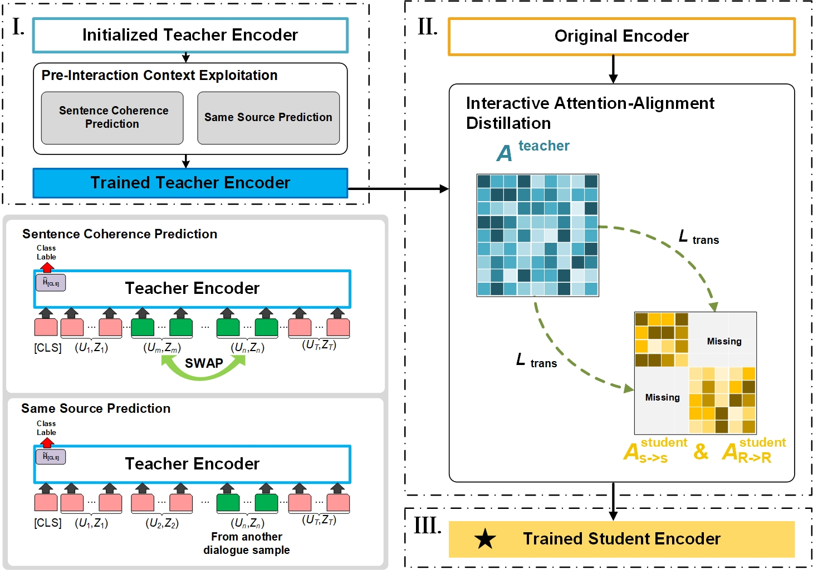

DICE_DST
==========

This paper/code introduces the Learning to Imagine: Distillation-Based Interactive Context Exploitation for Dialogue State Tracking (DICE_DST) on the Multi-Domain Wizard-of-Oz dataset (MultiWOZ).

You can find the paper [here](https://ojs.aaai.org/index.php/AAAI/article/view/26510)

See below for an overview of the model architecture:



  

## Requirements

Our model was trained on GPU Nvidia A40.  

- Python 3 (tested on 3.6.8)

- PyTorch (tested on 1.6.0)

- CUDA (tested on 10.1)

- transformers (tested on 2.1.0)


## Download and Preprocessing data

To download the MultiWOZ dataset and preprocess it, please run this script first.<br>
You can choose the version of the dataset. ('2.1', '2.0', '2.2')<br>

```
python3 create_data.py --main_dir $DOWNLOAD_PATH --target_path $TARGET_PATH --mwz_ver '2.1' # , '2.0' # or '2.2'
```

The downloaded original dataset will be located in `$DOWNLOAD_PATH`. After preprocessing, it will output three files -- train_dials.json, dev_dials.json, and test_dials.json out put them under the `$TARGET_PATH`.

## Training

To train the module, you can run the following scripts corresponding to each model:

```
python main/trainDiCoS.py
python main/trainDistillation.py
python main/trainDSS.py
python main/trainTeacher.py
```


## Evaluation

To evaluate the module, you can run the following script:

```
python test/test.py
```

## Contact
If you have any questions, you can contact Jinyu Guo(guojinyu@bupt.edu.cn).

## Citation

```
@article{Guo_Shuang_Zhang_Liu_Li_Wang_2023, title={Learning to Imagine: Distillation-Based Interactive Context Exploitation for Dialogue State Tracking}, volume={37}, url={https://ojs.aaai.org/index.php/AAAI/article/view/26510}, DOI={10.1609/aaai.v37i11.26510}, number={11}, journal={Proceedings of the AAAI Conference on Artificial Intelligence}, author={Guo, Jinyu and Shuang, Kai and Zhang, Kaihang and Liu, Yixuan and Li, Jijie and Wang, Zihan}, year={2023}, month={Jun.}, pages={12845-12853} }
```
